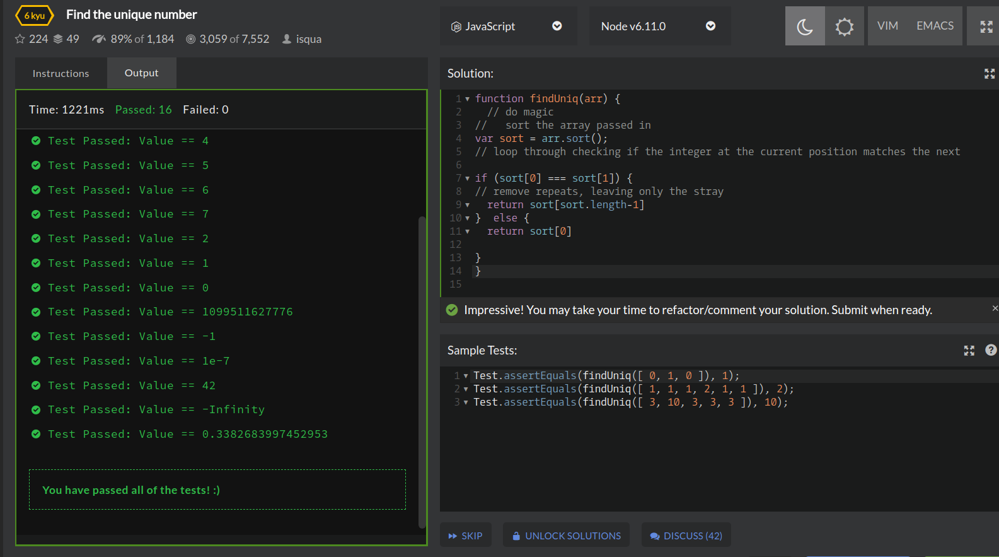

## CodeWars Challenge- 13

*Description:*
There is an array with some numbers. All numbers are equal except for one. Try to find it!

It’s guaranteed that array contains more than 3 numbers.

The tests contain some very huge arrays, so think about performance.

*Test Cases:*

1. // Basic tests (shuffled)
Test.assertEquals(findUniq([ 4, 4, 4, 3, 4, 4, 4, 4 ]),3);
Test.assertEquals(findUniq([ 5, 5, 5, 5, 4, 5, 5, 5 ]),4);
Test.assertEquals(findUniq([ 6, 6, 6, 6, 6, 5, 6, 6 ]),5);
Test.assertEquals(findUniq([ 7, 7, 7, 7, 7, 7, 6, 7 ]),6);
// The last item
Test.assertEquals(findUniq([ 8, 8, 8, 8, 8, 8, 8, 7 ]),7);
Test.assertEquals(findUniq([ 3, 3, 2, 3, 3, 3, 3, 3 ]),2);
Test.assertEquals(findUniq([ 2, 1, 2, 2, 2, 2, 2, 2 ]),1);
// The first item
Test.assertEquals(findUniq([ 0, 1, 1, 1, 1, 1, 1, 1 ]),0);

2. // Very big number
Test.assertEquals(
  findUniq(generateTestArr(Math.pow(2, 40), Math.pow(2, 50), 100)) , Math.pow(2, 40)
);

3. // Negative number
Test.assertEquals(
  findUniq(generateTestArr(-1, 1, 1000)) , -1
);

4. // Float number
Test.assertEquals(
  findUniq(generateTestArr(0.0000001, 0.0010001, 1000)) , 0.0000001
);

5. // Very long array
Test.assertEquals(
  findUniq(generateTestArr(42, 24, 10000000)),42
);

// Infitiy and -Infiity
Test.assertEquals(
  findUniq(generateTestArr(-Infinity, Infinity, 1000)) , -Infinity
);

6. // Random numbers
(() => {
  let a = Math.random();
  let b = Math.random();
  Test.assertEquals(
    findUniq(generateTestArr(a, b, 1000)) , a
  );
})();

## Languages Used

1. JavaScript
